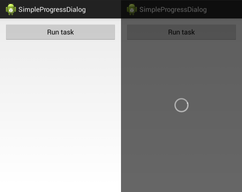

# Android-Progress

Simple progress bars and progress dialogs for Android

<p align="center">
	
</p>

## Installation

 * Include one of the [JARs](JARs) in your `libs` folder
 * or
 * Copy the Java package to your project's source folder
 * or
 * Create a new library project from this repository and reference it in your project

## Usage

### SimpleProgressDialog

```
// keep a reference to the currently opened dialog
private SimpleProgressDialog mProgressDialog;

...

// show the dialog
mProgressDialog = SimpleProgressDialog.show(this);

...

// close the dialog
if (mProgressDialog != null) {
	mProgressDialog.dismiss();
}
```

## License

```
Copyright (c) delight.im <info@delight.im>

Licensed under the Apache License, Version 2.0 (the "License");
you may not use this file except in compliance with the License.
You may obtain a copy of the License at

  http://www.apache.org/licenses/LICENSE-2.0

Unless required by applicable law or agreed to in writing, software
distributed under the License is distributed on an "AS IS" BASIS,
WITHOUT WARRANTIES OR CONDITIONS OF ANY KIND, either express or implied.
See the License for the specific language governing permissions and
limitations under the License.
```